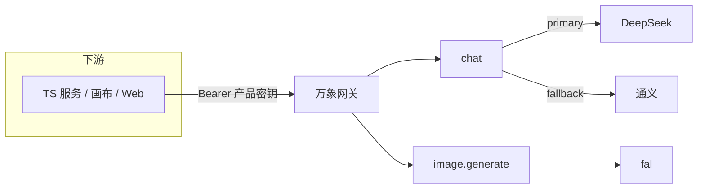

# 万象 / Myriad

**下游只对接万象，不对接具体模型。**

一种北向合同，七族协议，多渠道兜底。TypeScript 服务用 `@myriad/sdk`；浏览器走同一套 HTTP。

[快速开始](docs/quickstart.md) · [概念](docs/concepts.md) · [HTTP](docs/http.md) · [TypeScript SDK](docs/sdk.md) · [示例](docs/examples.md)

[](https://github.com/starcloud530/myriad/actions/workflows/ci.yml)
[](LICENSE)

```http
POST /v1/capabilities/chat
Authorization: Bearer <MYRIAD_KEY>
```

```ts
import { createMyriad } from "@myriad/sdk";

const myriad = createMyriad({
  baseUrl: "http://127.0.0.1:8791",
  apiKey: process.env.MYRIAD_KEY ?? "dev-key",
});

const { output } = await myriad.invoke("chat", {
  messages: [{ role: "user", content: "用一句话介绍万象" }],
});
```

## 为什么是万象

OpenRouter 把模型摊成一张货架。万象把**能力**当成一等公民：下游选的是 `chat` / `image.generate`，不是某一家的 SKU。厂商挂在渠道上，主渠道挂了再落到兜底。

| 你要做的 | 不要做的 |
|---|---|
| 带一把万象产品密钥 | 把 DeepSeek / fal Key 写进业务服务 |
| 打 `/v1/capabilities/:id` | 对接 `/v1/models` 或厂商 `/v3` |
| 用 `@myriad/sdk` | `import` 网关内部模块 |

## 核心能力

| 能力 id | 合同 | 说明 |
|---|---|---|
| `chat` | 对话 | 主渠道 DeepSeek，失败落到通义 |
| `image.generate` | 文生图 / 图生图 | `refs[]` 即编辑 |
| `video.generate` | 异步 job | 先回 `queued` |
| `audio.speech` | 语音合成 | 文本进，音频 uri 出 |
| `image-nsfw` / `portrait-quality` / `calorie-recognize` | 分类 / 打分 / 抽取 | 万象自建接线 |

货架上的型号（价格、上下文、渠道健康）在 [catalog/models](catalog/models)。调用仍走能力，不走 yaml 文件名。

## 30 秒跑通

```bash
git clone https://github.com/starcloud530/myriad.git
cd myriad
npm install
# 南向 Key 拷到 packages/gateway/.dev.vars（不入库）
npm run dev          # 网关 http://127.0.0.1:8791
npm run dev:web      # 广场 http://127.0.0.1:18081
```

控制台签发的 Key 网关当场认。下一步：[docs/quickstart.md](docs/quickstart.md)。



## 文档怎么读

按这个顺序，能用、用好、看见核心功能：

1. [快速开始](docs/quickstart.md) — 第一把 Key，第一次调用
2. [概念](docs/concepts.md) — 能力 / 型号 / 渠道 / 产品密钥
3. [HTTP](docs/http.md) — 契约、curl、错误码
4. [TypeScript SDK](docs/sdk.md) — 给其他服务用的包
5. [密钥](docs/keys.md) — 签发、轮换、南北向不要混
6. [示例](docs/examples.md) — 对话、生图、视频、语音
7. [目录约定](docs/README.md) — 仓库里文档怎么摆

## 仓库

```
apps/web          广场与控制台
apps/cli          命令行，依赖 @myriad/sdk
packages/sdk      给其他 TS 服务装的客户端
packages/gateway  Cloudflare Worker：鉴权 → 协议 → 渠道
catalog/models    货架 yaml（展示，不是密钥）
docs/             GitHub 可浏览的教程
```

协议合同在 `packages/gateway/src/protocol/`。新服务先对上七族，对不上才加合同，**不加第八族**。

## 参与

见 [CONTRIBUTING.md](CONTRIBUTING.md)。缺陷和功能用 [Issues](https://github.com/starcloud530/myriad/issues)。

## 许可

[MIT](LICENSE) © 万象 / Myriad
